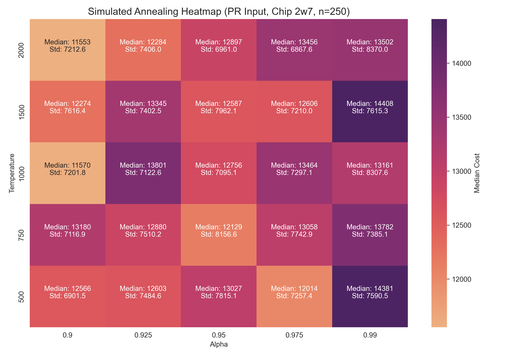
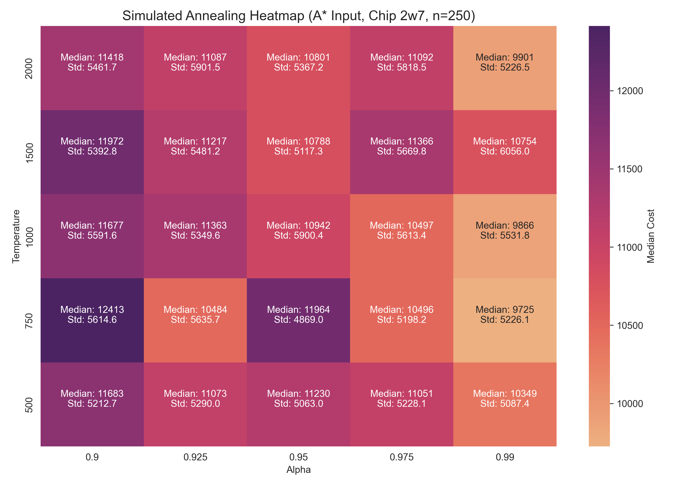
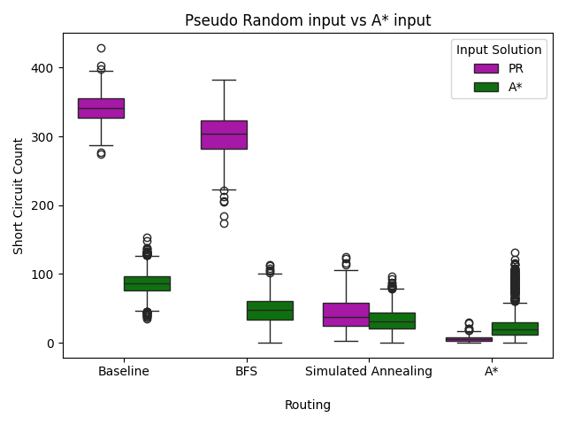
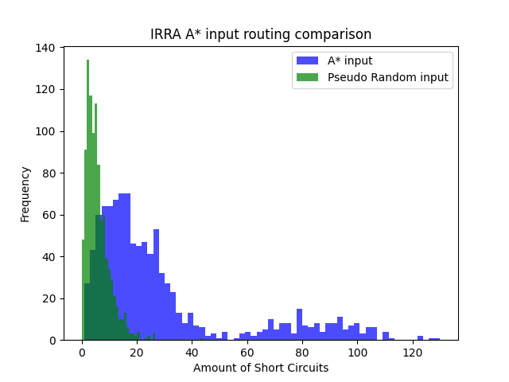
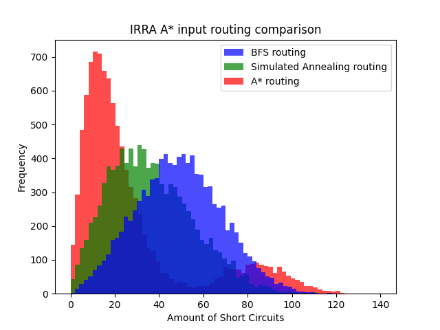

# Experiments 

In this chapter, we present the experiments conducted to evaluate our **iterative random rerouting algorithm (IRRA)** under different initial chip states and rerouting strategies. These **initial states** can be generated either by a pseudo-random (PR) algorithm or by an A\* pathfinding approach, while the **rerouting methods** tested include a BFS-based method with one-step lookahead, a BFS-based method enhanced with simulated annealing, and a pure A\* rerouting method. These experiments are all conducted on chip_2 with the configuration of netlist_7, i.e. chip 2w7, to ensure consistency among all experiments.

Our experimental goals were to:
1. **Tune the parameters** for the simulated annealing–based approach to ensure optimal performance for both PR and A\* initial states.
2. **Compare all six combinations** of initial states and rerouting methods, running each for an hour to analyze metrics such as efficiency (the number of viable solutions found in the allotted time) and short circuit amount.
3. **Compare A\* Rerouting for PR input vs. A\* input** by examining a histogram of short circuit counts created by running both algorithms a 1000 times. 
4. **Conduct 10,000 runs with A\* input** to get more insight into the differences in distributions of the three rerouting methods. 


Our findings revealed that while an **A\*-based initial state** produced solutions more **efficiently** (generating more solutions within the same time frame), the **PR + A\* rerouting** combination had the **lowest median cost** and **highest consistency**. However, we ultimately **focused on A\* input** because it combined **high efficiency** with **the ability to find the lowest costs** wihtin an hour. We then examined each rerouting method for A\* input for over 10,000 iterations to create histograms illustrating their performance differences.

Finally, we applied a new A\* optimizer to the best candidates found by IRRA. Early results show that this optimizer can **further reduce costs** by rerouting multiple wires simultaneously—an avenue that remains promising for future investigation.


## Parameter research

First, to explore and refine the parameters for our **simulated annealing** approach, we used an **exponential temperature function** of the form:

 $$ \text{temperature}(i) = \text{start\_temperature} \cdot (\alpha)^i $$

This temperature is plugged into our acceptance probability function:
```python
def acceptance_probability(new_cost: int, old_cost: int, temperature: int) -> int:

    if new_cost < old_cost:
        return 1

    if new_cost >= old_cost:
        return pow(2, (old_cost - new_cost) / temperature)
```

From a small preliminary test, we selected the following start temperatures and alpha values to systematically evaluate:

```python
temperature_candidates = [500, 750, 1000, 1500, 2000]
alpha_candidates = [0.9, 0.925, 0.95, 0.975, 0.99]
```

In total, this produced 25 parameter combinations. We ran each combination for 250 iterations. The results, visualized in the heatmap below, revealed the following optimal parameters:


<div align="center">

**A\* Input**:      start_temperature = 750, temperature_alpha = 0.99 <br>
**PR Input**:       start_temperature = 2000, temperature_alpha = 0.9

</div>


These findings suggest that for chips initialized via **A\***, a **moderate start temperature** with a **slower cooling rate** (alpha = 0.99) refines an already high-quality solution efficiently. In contrast, the **PR-based** approach benefits from a **higher start temperature** to escape poor initial placements, combined with a **more aggressive cooling rate** (alpha = 0.9). This is likely due to the relative higher cost of the PR initial state compared to the more refined A* starting state, thus promoting agressive early exploration, with a high cooling rate to prevent the formation of unsolvable dense wiring configurations. 

<div align="center">
  
  
</div>

## Method Comparison

In this section, we compare **six different methods** of using our IRRA: namely, combining **two possible initial states** (A\* or PR); with **three rerouting methods** (BFS , BFS + simulated annealing, and pure A\* rerouting). While our initial focus was to minimize the *overall cost* of the chip, we soon shifted to *short circuit count* as a more direct and interpretable measure of chip viability. *Cost* remains important when short circuit reaches zero, however in this current state *short circuit count* is still the main driving force of our cost function. To compare these six methods we used a runtime of one hour. 

We conclude that **A\* Input** outperforms **PR Input** in overall efficiency (more runs completed in the same time) and typically yields lower median short circuits. For instance, BFS (no SA) with A\* input achieved a median short circuit of 48 compared to 304 with PR input. The primary argument to choose PR Input over A\* Input is that it outperformed all methods when using A\* rerouting in terms of consistency in achieving a low short circuit count. However, it is important to emphasize that we are not interested in just consisteny, A\* input in combination with BFS rerouting managed to find the lowest costing chip by being able to explore more than 10x as many possibilities than its more consistent competitor.  

What might be the reason for this consistent outperformance? A pseudo-random initial layout is naturally more chaotic and prone to short circuits, but A\* Rerouting systematically explores optimal or near-optimal paths for wire rearrangements. This targeted exploration allows it to resolve or avoid collisions more effectively than BFS-based methods—even those enhanced by simulated annealing. In contrast, when starting from an A\*-optimized chip, the routing is already quite efficient, so the relative advantage of A\* Rerouting over BFS-based methods (including SA) is smaller but still significant.

However, using PR input is significantly worse in terms of efficiency. In addition to BFS being slower than A* for the initial routing, a major reason for PR’s inefficiency is that the wire creation process can produce improperly connected chips. This forces regenerations whenever a gate becomes blocked, which especially increases setup time as chip complexity grows. In contrast, A* generation ensures connectivity and quickly identifies feasible routes. 

| Input Method   | Rerouting Method        | Lowest Short Circuit | Lowest Cost Found | Number of Runs in 1 hour |
|----------------|-------------------------|-----------------------|-----------------|----------------|
| **A\***        | BFS                    | 0                     | 912             | 3344           |
| **A\***        | BFS + Simulated Annealing | 0                  | 932             | 1179           |
| **A\***        | A\* Rerouting          | 0                     | 916             | 1222           |
| **PR**         | BFS                  | 174                   | 53252           | 331            |
| **PR**         | BFS + Simulated Annealing | 2                | 1608            | 270            |
| **PR**         | A\* Rerouting        | 0                     | 944             | 321            |

We developed a simple method to estimate the absolute lowest possible cost. While this lower limit is unlikely to be reached, it provides a benchmark that cannot be undercut. The technique is straightforward: we sum all minimal distances for the required connections without considering any short circuits, thus determining the minimal cable length for a fully connected chip. For chip 2w7, our test subject, this limit is 600. Although our best solution so far costs 916, indicating room for improvement, it stands in stark contrast to the A* baseline’s median of 24390. Consequently, we can confidently conclude that all methods using A* as input are performing strongly.

### Key takeaways:

1. **A\* Input** remains the **most efficient starting point overall** due to its quick generation of connected layouts. Combined with **A\* Rerouting**, it consistently produces **low short circuit counts** and often reaches zero.
2. **PR Input** struggles with high short circuits and low efficiency under basic BFS rerouting, but **A\* Rerouting** can still salvage these chaotic layouts, leading to surprisingly strong results (median short circuit = 5, lowest = 0).
3. **BFS + Simulated Annealing** shows improvements over plain BFS but cannot match the targeted pathfinding precision of **A\* Rerouting**, especially from a random initial state.

WE conclude that an **A\*-based approach**—both in **initial chip generation** and in **rerouting**—tends to yield the most consistent results, while **PR input combined with A\* Rerouting** can also be a viable approach if the algorithm creating PR input can be improved considerably.

<div align="center-left">
  
</div>

One intriguing comparison is **A\* rerouting** applied to both **A\* and PR initial states**. We plotted a histogram to compare these two methods further. 

- **PR Input + A\* Rerouting** shows a **high, narrow peak** around **5** short circuits, indicating a **lower standard deviation**.
- **A\* Input + A\* Rerouting** shows a primary peak around **17** short circuits but also displays a resurgence spanning from **60 to about 110** short circuits.

This additional noise for A\* input may stem from scenarios in which the initial A\* layout ends up with a relative high short circuit count, and the A\* rerouting process struggles to resolve them. By contrast, a more “chaotic” PR layout often presents more possible reroute options, giving the A\* rerouting method a greater chance to reduce collisions effectively and achieve low short circuit counts. Consequently, while A\* input typically yields efficient, near-collision-free routes at the outset, certain atypical runs can still produce many short circuits that prove difficult to remedy, leading to a broader spread in outcomes.

<div align="left">
  
</div>

Building on our conclusion that **A\* input** is likely the best path forward—especially as chip complexity grows: we conducted **10,000 runs** of each rerouting method using A\* as the initial state. This extensive experiment provided deeper insights into the distribution of short circuit counts:

1. **A\* Rerouting’s Second Peak**  
   In line with our previous histogram observations, **A\* rerouting** exhibits **two distinct peaks**. One peak is around **low short circuit counts**, confirming A\*’s ability to efficiently minimize collisions, while the other, more surprising **second peak** centers around approximately **84** short circuits. This second peak suggests that in a subset of runs, the A\* rerouter encounters configurations that are harder to correct.

2. **BFS Rerouting Distributions**  
   Both **BFS** and **BFS + Simulated Annealing** (SA) distributions appear **less skewed**, indicating a more even spread of outcomes. In other words, these methods rarely cluster around extremely low or extremely high short circuit counts; instead, they settle into a more uniform range. BFS + SA shows improved performance compared to plain BFS, but its distribution remains fairly unskewed, suggesting a consistent (though not always minimal) level of improvement.

3. **Performance Ranking**  
   Overall, these runs confirm that:
   - **BFS + SA** improves upon **BFS** alone, driving short circuit counts lower and more consistently.
   - **A\* Rerouting** remains the **best** of the three, despite its tendency to generate a secondary higher-short-circuit peak in some cases.

Hence, while all three methods benefit from A\* input, A\* rerouting continues to yield the most low-short-circuit outcomes on average, solidifying its position as the preferred rerouting strategy.

<div align="left">
  
</div>


[TODO: SECTION ON OPTIMIZATION?]


## How to run the experiments

...


Thanks to:
https://algorithmafternoon.com/books/simulated_annealing/chapter02/