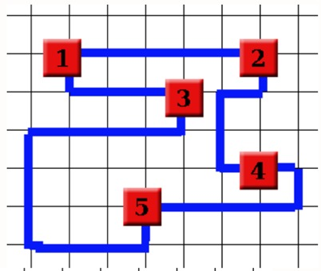
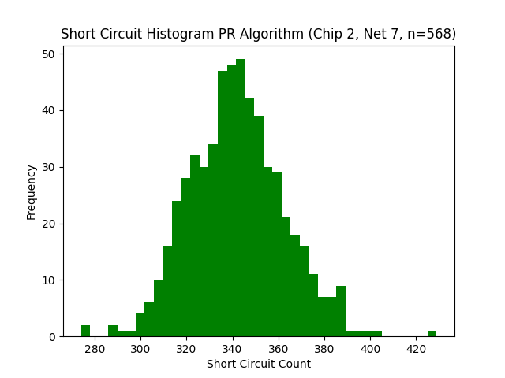
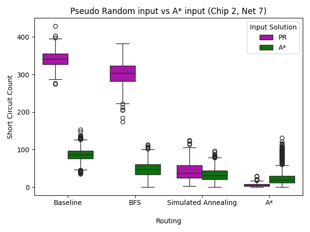

# Chips & Circuits

Integrated circuits (commonly known as chips) are crucial for modern devices like smartphones, laptops, household appliances, cars, and the list goes on. They perform critical functions like computation, memory storage and communication. When chips are created they start off as logical designs, which are translated into netlists specifying how gates must connect. The final and most delicate step is physically arranging these connections on a silicon base.

This physical wiring process is challenging. Efficient layouts with short wires yield faster, cheaper circuits, while poor arrangements with long or intersecting wires degrade performance and inflate costs. To simplify the problem, we assume gates are already placed on a grid. **Our task is to optimally connect these gates with wires**, adhering to these four constraints:

1. Wires follow grid lines and cannot be placed diagonally. 

2. Different wires cannot share line segments (which would cause a collisions).

3. Wires are continuous.

4. Wires can not pass through gates which are not their own.

A chip is functional if and only if all gates are connected correctly and no constraints are violated. The cost function of a chip is the following: 

$$C = n + 300 \times k$$

Where $n$ represents the total length of all wires, and $k$ is the number of short circuits caused by different wires intersecting in the chip.

### Example:

We start with the following information:

<div style="display: flex; justify-content: center; gap: 20px; text-align: center;" >

<!-- First Table -->
<div>

| **#Netlist** |
|----------------|
| 1 – 2          |
| 1 – 3          |
| 3 – 5          |
| 4 – 2          |
| 4 – 5          |

</div>

<!-- Second Table -->
<div>

| **Gate** | **Coordinates** |
|---------|---------------|
| 1       | $(1,5)$        |
| 2       | $(5,5)$        |
| 3       | $(3,5)$        |
| 4       | $(5,2)$        |
| 5       | $(2,1)$        |


</div>

</div>

<br>

Here are two valid wire configurations for the same netlist profile. The right solution is better: less wiring is used to connect the same gates, lowering the cost of production. 

<div align="center">
  
  
</div>

**Our goal is to find a cost-minimal wire configuration for each of the three chips, each containing three corresponding netlists.** These chips and their corresponding netlist can be found in the `data` folder.

Our best solutions can be found at `results/best_chip_configs` and are saved as csv files containing:

- Header row: `net,wires`
- Rows of the form: `<netlist_connection>, <wire_segments>`
- Footer row: `chip_<chip_id>_net_<net_id>,<total_cost>`. 

Additionally, these solutions can be opened as a 3D-plot by opening the html-files at `results/best_chip_configs/chip_config_plots` with your browser of choice. 

## Requirements 

This codebase is entirely written in Python 3.13. To install all the necessary requirements use:

```
pip install -r requirements.txt
```

Or use conda:

```
conda install --file requirements.txt
```

## Usage

To execute the different algorithms, run:

```
python main.py
```

By using different command-line arguments, different parameters can be changed. To find out which options can be used, run:

```
python main.py --help
```
### Main Options  
The most important options include:  

- **`-c`**: Set the chip configuration.  
- **`-w`**: Set the netlist configuration.  
- **`-a`**: Choose the algorithm to use.  
- **`-o`**: Optimize the configuration after it is created to achieve a lower-cost result.

<br>
So for example to execute the A* algorithm, with chip 2 and netlist 7, optimizing the result afterwards, you would run:

```
python main.py -c 2 -w 7 -a "A*" -o
```

<br>

If you want to adjust the balance between optimization quality and speed, you can modify the following parameters:  

- **`total_permutations_limit`** – Controls the permutation limit when rerouting multiple wires at the same time.  
- **`amount_of_random_iterations`** – Adjusts the number of random permutations performed after permutation limit is exceeded. 

### Running Experiments  
To run an experiment, uncomment the relevant code in the 'experiment' section in `main.py`. The same applies to generating a visualization of the experiment after execution. 

For more details, see: [How to run and visualize the experiments](#how-to-run-and-visualize-the-experiments)

## Repository Structure

- **`data/`**: Contains CSV files with chip structures and netlists.  
- **`results/`**: Stores experiment results, chip configurations, and plots, organized into:  
  - `best_chip_configs/`: Contains the csv output files and interactive plots of the best results. 
  - `best_chip_configs_candidates/`: Contains the csv output files and interactive plots of candidate results to use optimization on.
  - `experiments/`: Contains the results of the ran experiments
  - `latest/`: Is created when running a new algorithm, experiment or visualisation. Take important results out of this folder to avoid it being overwritten.
- **`src/`**: Contains all project code, split into:  
  - `algorithms/`: Contains the code for the algorithms.  
  - `classes/`: Defines core classes `Chip`, `Occupancy`, and `Wire`.  
  - `experiments/`: Scripts for parameter research and routing comparisons.  
  - `visualisation/`: Code for generating visual plots from experiment results.  
- [main.py](./main.py): Entry point for running the project.
- [requirements.txt](./requirements.txt): Lists Python dependencies.  

## State Space

Let's break down our problem to assess its size: find the optimal configuration of cables that connects all gates to each other according to the netlist. This is a **constraint optimization problem**.

The tricky part of the state space of this problem is that if we relax the constraint (cables are allowed to overlap each other), the state space becomes infinitely large, because a cable can always be added to every configuration.

To still obtain a finite state space, we have made a few assumptions. First, to simplify the problem, we assumed the chip consists of a single layer, meaning a 2D grid. Then, we made this grid finite (with dimensions $r \times k$, where $r = \text{rows}$, $k = \text{columns}$). Furthermore, we considered there to be an upper bound on cable length when the entire grid is filled with cables, even though it is never actually possible to achieve this from 1 cable without overlap. However, this way we know this is the maximum cable length at which every gate is connected to every other gate. The optimal solution will therefore not have cables longer than this maximum length $(L_{max})$, as any additional cable would inevitably overlap with another, violating our constraints.

The maximum length of all cables is when there is a cable in every possible place in the $r \times k$ grid. The total cable length then becomes:

$$
L_{max} = (r - 1) \cdot k + (k - 1) \cdot r = 2rk - (r + k)
$$

When we have reached this length, we know for sure that all gates are connected to each other since everything is interconnected. We also know for certain that the cable cannot be longer than this length, because then cables would have to overlap, which is not allowed. 

Now we assess the following, when we lay a cable, we can choose from 3 directions: left, straight ahead, or right. This means we have $3$ options each time we add another wire segment. So the total number of possible cable paths that have the maximum length is therefore:

$$
\text{state space (only max cables)} = 3^{2rk - (r + k)}
$$

But this is only the state space for cables of maximum length, while the solution to the problem can also have shorter cables. The shortest the cables can be, is the sum of all distances between the gates. Because with a shorter cable, not all gates could be reached and connected, and thus it is not a valid solution. We can write this minimum distance as follows:

$$
L_{min} = \sum_{i, j} \sum_{k = 1}^{\dim} \bigl|\bigl(\vec{r_i} - \vec{r_j}\bigr)_k\bigr|
$$

Here, the inner sum is over all vector components between two gates (i.e. $\Delta x + \Delta y$ in 2D) and the outer sum is over all gate pairs in the netlist.

We therefore know that the optimal solution will have a cable length between $L_{min}$ and $L_{max}$. We can then determine the total state space ($\Omega$) with the following formula:

$$
\Omega = \sum_{i=L_{min}}^{L_{max}} 3^{i}
$$

<br>

If we only calculate the last 3 terms of $\Omega$ (so if $L_{min} = L_{max} - 3$, which is an extremely high $L_{min}$) for different grid sizes, we see that the state space increases enormously:

<br>

$$
\Omega_{3 \times 3} = 3^{2 \cdot 3 \cdot 3 - (3 + 3) - 2} + 3^{2 \cdot 3 \cdot 3 - (3 + 3) - 1} + 3^{2 \cdot 3 \cdot 3 - (3 + 3)} = 7.7 \cdot 10^{5}
$$

$$
\Omega_{3 \times 4} = 3^{2 \cdot 3 \cdot 4 - (3 + 4) - 2} + 3^{2 \cdot 3 \cdot 4 - (3 + 4) - 1} + 3^{2 \cdot 3 \cdot 4 - (3 + 4)} = 1.9 \cdot 10^{9}
$$

$$
\Omega_{4 \times 4} = 3^{2 \cdot 4 \cdot 4 - (4 + 4) - 2} + 3^{2 \cdot 4 \cdot 4 - (4 + 4) - 1} + 3^{2 \cdot 4 \cdot 4 - (4 + 4)} = 4.1 \cdot 10^{11}
$$

<br>

$$
\Omega_{12 \times 17} = 3^{2 \cdot 12 \cdot 17 - (12 + 17) - 2} + 3^{2 \cdot 12 \cdot 17 - (12 + 17) - 1} + 3^{2 \cdot 12 \cdot 17 - (12 + 17)} = 9.7 \cdot 10^{180} \quad (\text{Chip 1})
$$

$$
\Omega_{16 \times 17} = 3^{2 \cdot 16 \cdot 17 - (16 + 17) - 2} + 3^{2 \cdot 16 \cdot 17 - (16 + 17) - 1} + 3^{2 \cdot 16 \cdot 17 - (16 + 17)} = 9.3 \cdot 10^{243} \quad (\text{Chip 2})
$$

<br>

And these calculations are in 2D. In 3D, the maximum cable length $(L_{max})$ becomes much larger. The general formula is:

$$
L_{max} = (r - 1) \cdot k \cdot h + r \cdot (k - 1) \cdot h + r \cdot k \cdot (h - 1)
$$

For our chips, the grid height is fixed, namely $h = 8$. If we substitute and simplify, we ultimately find:

$$
L_{max} = 23rk - 8(r + k)
$$

<br>

Furthermore, the number of choices per coordinate increases from 3 to 5 (namely upward and downward are added). We can then calculate the 3D state space as:

$$
\Omega = \sum_{i=L_{min}}^{L_{max}} 5^{i}
$$

To give an idea of the increase in the state space in 3D, this is the state space of $3 \times 3$ if we can place cables up to a height of 8:

$$
\Omega_{3 \times 3 \times 8} = 5^{23 \cdot 3 \cdot 3 - 8(3 + 3) - 2} + 5^{23 \cdot 3 \cdot 3 - 8(3 + 3) - 1} + 5^{23 \cdot 3 \cdot 3 - 8(3 + 3)} = 1.7 \cdot 10^{111}
$$

<br>

And for the most complex chip and netlist we can determine the state space by calculating $L_{min}$ first. We find:

$$
L_{min} = 761
$$

The full state space then becomes:

$$
\Omega_{16 \times 17 \times 8} = \sum_{i=761}^{23 \cdot 16 \cdot 17 - (16 + 17)} 5^i \approx 2.1 \cdot 10^{4188}
$$

## Our Approach: Iterative Random Rerouting

To solve this challenge of **minimizing total wire length** and **reducing short circuits** in chip layouts, we employ an **Iterative Random Rerouting Algorithm (IRRA)**. IRRA begins by creating an initial wiring configuration. It then **repeatedly identifies and “fixes”** short circuits by removing wires around each collision point and attempting to reroute them in a more efficient way that avoids short circuits.

### Class Structure
The accompanying UML diagram shows how our classes are organized:

- **`Chip`**  
  A central class responsible for storing gates, wires, and a specialized **`Occupancy`** grid, which helps check if a coordinate is free or already used by wires/gates.

- **`Occupancy`**  
  Stores wire and gate usage per coordinate. This ensures that no two wires overlap and that no wire can block another gate from making its connection.

- **`Wire`**  
  Contains the coordinates of each segment from an individual wire on the 3D grid. It also offers collision checks and length calculations.

- **Algorithm Classes**  
  - **`Greed`** / **`Greed_random`** provide basic BFS routing, optionally randomizing the order in which wires are placed.  
  - **`A_star`** applies a heuristic-driven pathfinding approach (inherited from `Greed`) to find shorter wire paths.  
  - **`A_star_optimize`** further optimizes fully connected solutions by removing multiple wires at the same time and rerouting them with `A_star`.  
  - **`Pseudo_random`** and **`True_random`** extend `Greed_random` with even more random-based expansions.  
  - **`IRRA_PR`** and **`IRRA_A_star`** integrate Iterative Random Rerouting either with `Pseudo_random` (PR) or `A_star` as input solution.

<br>

<div align="center">
  
</div>

<br>

Our main idea was that **short circuits are the primary driver of higher chip costs**, so eliminating them takes priority over simply minimizing wire distance. To achieve this, we created the **IRRA** to generate solutions that contain no short circuits. However, the IRRA itself can be used in multiple ways: different **starting configurations** (e.g., `Pseudo_random` or `A_star`) and different **rerouting methods** (BFS, BFS + simulated annealing, or A*). In the experiments below, we explore which combination yields the best results. Furthermore, once we obtain a layout without short circuits (or as little as possible), we continue **reducing costs** by applying `A_star_optimize`, which reroutes multiple wires simultaneously (while still avoiding short circuits). This **drastically decreases** the total wire length and thus the overall cost of solutions already free of short circuits.

For a more in-depth explanation on the workings of our algorithms and classes please take a look at our source code at `src/algorithms` and `src/classes`.

## Baseline

In the histograms below, we show the cost and intersection distribution obtained from a series of randomly generated solutions for chip 2 with netlist 7. These solutions are generated by what we refer to as our **Pseudo Random** (PR) algorithm. Because the goal of this baseline is to sample the broader solution space, it makes little sense to pick purely random wire placements, as that would very rarely result in a valid chip configuration. Therefore, our algorithm enforces a few critical constraints to ensure that valid solutions do emerge:

1. **All wires must connect** their respective gates.  
2. Wires **cannot pass through gates** other than their own.  
3. Two wires **may not share a grid line segment**, preventing direct *collisions*.

Our PR algorithm thus works more purposefully than a purely random method. Specifically, it attempts to generate a random target length for each wire before laying it down, then runs a **Breadth First Search (BFS)** to find a path of precisely that length connecting the two gates. If no path is found, the algorithm picks a different random length and tries again, repeating this until all wires are successfully connected.

Although this approach ensures that *collisions* are avoided by construction, it does not avoid *short circuits*, i.e., wires crossing over each other. As a result, even though all solutions are valid by definition (all gates connected and no collisions), their **short circuit count** (and therefore their total costs) can vary dramatically. This variability is precisely what makes the Pseudo Random method suitable as a baseline: it produces a broad range of solutions from the feasible solution space without artificially biasing toward or against wiring choices that lead to short circuits.

Looking at the two histograms below, we notice that **the distributions for both cost and intersection count are identical**. The reason for this is straightforward: the penalty for short-circuiting is so severe that the number of short circuits primarily determines the overall cost. In the following experiment section, we will explore this perspective in more detail, as it enhances both the readability and intuitiveness of our optimization results.

Furthermore, we see that **the distributions of costs are not uniform**. This is because there are many more ways to lay wires with a moderate number of short circuits than there are ways to avoid short circuits entirely. As a result, the algorithm’s randomization naturally samples more solutions with some short circuits. 

<div align="center">
  
  
</div>

### Finding the baseline yourself

To find the baseline yourself, you can go into `main.py` and in 'experiments' uncomment the code for 'Solution Distribution'. To recreate our results you should set algorithm_name as "PR" and iterations to 1000 iterations. Then run:

```
python main.py -c 2 -w 7
```

This should create a `chip2w7_pr_solution_distrib.json` file in `results/latest`.

Then to visualise the results, uncomment the code under 'visualisations' and then 'Solution Distribution Histogram' in `main.py` and rerun:

```
python main.py -c 2 -w 7
```

This should create the two baseline histograms in `results/latest/experiment_plots`. You may also want to change the amount of bins to better visualise the distribution.

And if you're interested, you may also try different distributions for different algorithms by changing the algorithm_name from "PR" to a different algorithm by using any of the following: 

- 'Greed'
- 'Greed Random' or 'GR'
- 'Pseudo Random' or 'PR'
- 'True Random' or 'TR'
- 'A*'
- 'IRRA_PR'
- 'IRRA_A*'


## Experiments 

In this chapter, we present the experiments conducted to evaluate our **iterative random rerouting algorithm (IRRA)** under different initial chip states and rerouting strategies. These **initial states** can be generated either by a pseudo-random (PR) algorithm or by an A\* pathfinding approach, while the **rerouting methods** tested include a BFS-based method with one-step lookahead, a BFS-based method enhanced with simulated annealing, and a pure A\* rerouting method. These experiments are all conducted on chip_2 with the configuration of netlist_7, i.e. chip 2w7, to ensure consistency among all experiments.

Our experimental goals were to:
1. **Tune the parameters** for the simulated annealing–based approach to ensure optimal performance for both PR and A\* initial states.
2. **Compare all six combinations** of initial states and rerouting methods, running each for an hour to analyze metrics such as efficiency (the number of viable solutions found in the allotted time) and short circuit amount.
3. **Compare A\* Rerouting for PR input vs. A\* input** by examining a histogram of short circuit counts created by running both algorithms a 1000 times. 
4. **Conduct 10,000 runs with A\* input** to get more insight into the differences in distributions of the three rerouting methods. 


Our findings revealed that while an **A\*-based initial state** produced solutions more **efficiently** (generating more solutions within the same time frame), the **PR + A\* rerouting** combination had the **lowest median cost** and **highest consistency**. However, we ultimately **focused on A\* input** because it combined **high efficiency** with **the ability to find the lowest costs** within an hour. We then examined each rerouting method for A\* input for over 10,000 iterations to create histograms illustrating their performance differences.

Finally, we applied a new A\* optimizer to the best candidates found by IRRA. Early results show that this optimizer can **further reduce costs** by rerouting multiple wires simultaneously—an avenue that remains promising for future investigation.


### **Parameter research**

First, to explore and refine the parameters for our **simulated annealing** (SA) approach, we used an **exponential temperature function** of the form:

$$T(i) = T_{start} \cdot \alpha^i,$$

where $T$ is the temperature at a given point, $T_{start}$ the set start temperature, $\alpha$ the cooling rate and $i$ the current iteration.

This temperature is plugged into our acceptance probability function:
```python
def acceptance_probability(new_cost: int, old_cost: int, temperature: int) -> int:

    if new_cost < old_cost:
        return 1

    if new_cost >= old_cost:
        return pow(2, (old_cost - new_cost) / temperature)
```

From a small preliminary test, we selected the following start temperatures and alpha values to systematically evaluate:

```python
temperature_candidates = [500, 750, 1000, 1500, 2000]
alpha_candidates = [0.9, 0.925, 0.95, 0.975, 0.99]
```

In total, this produced 25 parameter combinations. We ran each combination for 250 iterations. The results, visualized in the heatmap below, revealed the following optimal parameters:


<div align="center">

**A\* Input**:      start_temperature = 750, temperature_alpha = 0.99 <br>
**PR Input**:       start_temperature = 2000, temperature_alpha = 0.9

</div>


These findings suggest that for chips initialized via **A\***, a **moderate start temperature** with a **slower cooling rate** (alpha = 0.99) refines an already high-quality solution efficiently. In contrast, the **PR-based** approach benefits from a **higher start temperature** to escape poor initial placements, combined with a **more aggressive cooling rate** (alpha = 0.9). This is likely due to the relative higher cost of the PR initial state compared to the more refined A* starting state, thus promoting agressive early exploration, with a high cooling rate to prevent the formation of unsolvable dense wiring configurations. 
<br>

<div align="center">
  
  
</div>

### **Method Comparison**

In this section, we compare **six different methods** of using our IRRA: namely, combining **two possible initial states** (A\* or PR); with **three rerouting methods** (BFS , BFS + simulated annealing, and pure A\* rerouting). While our initial focus was to minimize the *overall cost* of the chip, we soon shifted to *short circuit count* as a more direct and interpretable measure of chip viability. *Cost* remains important when short circuit reaches zero, however in this current state *short circuit count* is still the main driving force of our cost function. To compare these six methods we used a runtime of one hour. 

We conclude that **A\* Input** outperforms **PR Input** in overall efficiency (more runs completed in the same time) and typically yields lower median short circuits. For instance, BFS (no SA) with A\* input achieved a median short circuit of 48 compared to 304 with PR input. The primary argument to choose PR Input over A\* Input is that it outperformed all methods when using A\* rerouting in terms of consistency in achieving a low short circuit count. However, it is important to emphasize that we are not interested in just consistency, A\* input in combination with BFS rerouting managed to find the lowest costing chip by being able to explore more than 10x as many possibilities than its more consistent competitor.  

What might be the reason for this consistent outperformance? A pseudo-random initial layout is naturally more chaotic and prone to short circuits, but A\* Rerouting systematically explores optimal or near-optimal paths for wire rearrangements. This targeted exploration allows it to resolve or avoid collisions more effectively than BFS-based methods—even those enhanced by simulated annealing. In contrast, when starting from an A\*-optimized chip, the routing is already quite efficient, so the relative advantage of A\* Rerouting over BFS-based methods (including SA) is smaller but still significant.

However, using PR input is significantly worse in terms of efficiency. In addition to BFS being slower than A* for the initial routing, a major reason for PR’s inefficiency is that the wire creation process can produce improperly connected chips. This forces regenerations whenever a gate becomes blocked, which especially increases setup time as chip complexity grows. In contrast, A* generation ensures connectivity and quickly identifies feasible routes. 

| Input Method   | Rerouting Method        | Lowest Short Circuit | Lowest Cost Found | Number of Runs in 1 hour |
|----------------|-------------------------|-----------------------|-----------------|----------------|
| **A\***        | BFS                    | 0                     | 912             | 3344           |
| **A\***        | BFS + Simulated Annealing | 0                  | 932             | 1179           |
| **A\***        | A\* Rerouting          | 0                     | 916             | 1222           |
| **PR**         | BFS                  | 174                   | 53252           | 331            |
| **PR**         | BFS + Simulated Annealing | 2                | 1608            | 270            |
| **PR**         | A\* Rerouting        | 0                     | 944             | 321            |

We developed a simple method to estimate the absolute lowest possible cost. While this lower limit is unlikely to be reached, it provides a benchmark that cannot be undercut. The technique is straightforward: we sum all minimal distances for the required connections without considering any short circuits, thus determining the minimal cable length for a fully connected chip. For chip 2w7, our test subject, this limit is 600. Although our best solution so far costs 916, indicating room for improvement, it stands in stark contrast to the A* baseline’s median of 24390. Consequently, we can confidently conclude that all methods using A* as input are performing strongly.

#### **Key takeaways:**

1. **A\* Input** remains the **most efficient starting point overall** due to its quick generation of connected layouts. Combined with **A\* Rerouting**, it consistently produces **low short circuit counts** and often reaches zero.
2. **PR Input** struggles with high short circuits and low efficiency under basic BFS rerouting, but **A\* Rerouting** can still salvage these chaotic layouts, leading to surprisingly strong results (median short circuit = 5, lowest = 0).
3. **BFS + Simulated Annealing** shows improvements over plain BFS but cannot match the targeted pathfinding precision of **A\* Rerouting**, especially from a random initial state.

We conclude that an **A\*-based approach**—both in **initial chip generation** and in **rerouting**—tends to yield the most consistent results, while **PR input combined with A\* Rerouting** can also be a viable approach if the algorithm creating PR input can be improved considerably.

<br>

<div align="center">
  
</div>

<br>

One intriguing comparison is **A\* rerouting** applied to both **A\* and PR initial states**. We plotted a histogram to compare these two methods further. We conclude:

- **PR Input + A\* Rerouting** shows a **high, narrow peak** around **5** short circuits, indicating a **lower standard deviation**.
- **A\* Input + A\* Rerouting** shows a primary peak around **17** short circuits but also displays a resurgence spanning from **60 to about 110** short circuits.

This additional noise for A\* input may stem from scenarios in which the initial A\* layout ends up with a relative high short circuit count, and the A\* rerouting process struggles to resolve them. By contrast, a more “chaotic” PR layout often presents more possible reroute options, giving the A\* rerouting method a greater chance to reduce collisions effectively and achieve low short circuit counts. Consequently, while A\* input typically yields efficient, near-collision-free routes at the outset, certain atypical runs can still produce many short circuits that prove difficult to remedy, leading to a broader spread in outcomes.

<br>

<div align="center">
  
</div>

<br>

Building on our conclusion that **A\* input** is likely the best path forward—especially as chip complexity grows: we conducted **10,000 runs** of each rerouting method using A\* as the initial state. This extensive experiment provided deeper insights into the distribution of short circuit counts:

1. **A\* Rerouting’s Second Peak**  
   In line with our previous histogram observations, **A\* rerouting** exhibits **two distinct peaks**. One peak is around **low short circuit counts**, confirming A\*’s ability to efficiently minimize collisions, while the other, more surprising **second peak** centers around approximately **84** short circuits. This second peak suggests that in a subset of runs, the A\* rerouter encounters configurations that are harder to correct.

2. **BFS Rerouting Distributions**  
   Both **BFS** and **BFS + Simulated Annealing** (SA) distributions appear **less skewed**, indicating a more even spread of outcomes. In other words, these methods rarely cluster around extremely low or extremely high short circuit counts; instead, they settle into a more uniform range. BFS + SA shows improved performance compared to plain BFS, but its distribution remains fairly unskewed, suggesting a consistent (though not always minimal) level of improvement.

3. **Performance Ranking**  
   Overall, these runs confirm that:
   - **BFS + SA** improves upon **BFS** alone, driving short circuit counts lower and more consistently.
   - **A\* Rerouting** remains the **best** of the three, despite its tendency to generate a secondary higher-short-circuit peak in some cases.

Hence, while all three methods benefit from A\* input, A\* rerouting continues to yield the most low-short-circuit outcomes on average, solidifying its position as the preferred rerouting strategy.

<br>

<div align="center">
  
</div>


### How to run and visualize the experiments
To run these experiments yourself, go to `main.py`and uncomment the experiment you want to run in the 'experiments' section. You're free to change the parameters to change the test, but the given parameters are what we used. Then run:

```
python main.py -c 2 -w 7
```

To visualize the experiment results, uncomment the corresponding visualisation function in the 'visualisation' section (also in main.py).

Note: If you reran the experiment, you may want to change the json file path arguments to match with your experiment results in `results/latest/parameter_research/`. Also uncomment the experiments in the 'experiments' section you ran before to avoid rerunning it again.

Then run again:

```
python main.py -c 2 -w 7
```

This should create the plots in `results/latest/experiment_plots`.


## Acknowledgements

Special thanks to: Jason Browlee for his book on simulated annealing
https://algorithmafternoon.com/books/simulated_annealing/

## Authors
- Titus van Zandwijk
- Marc Serrano Altena